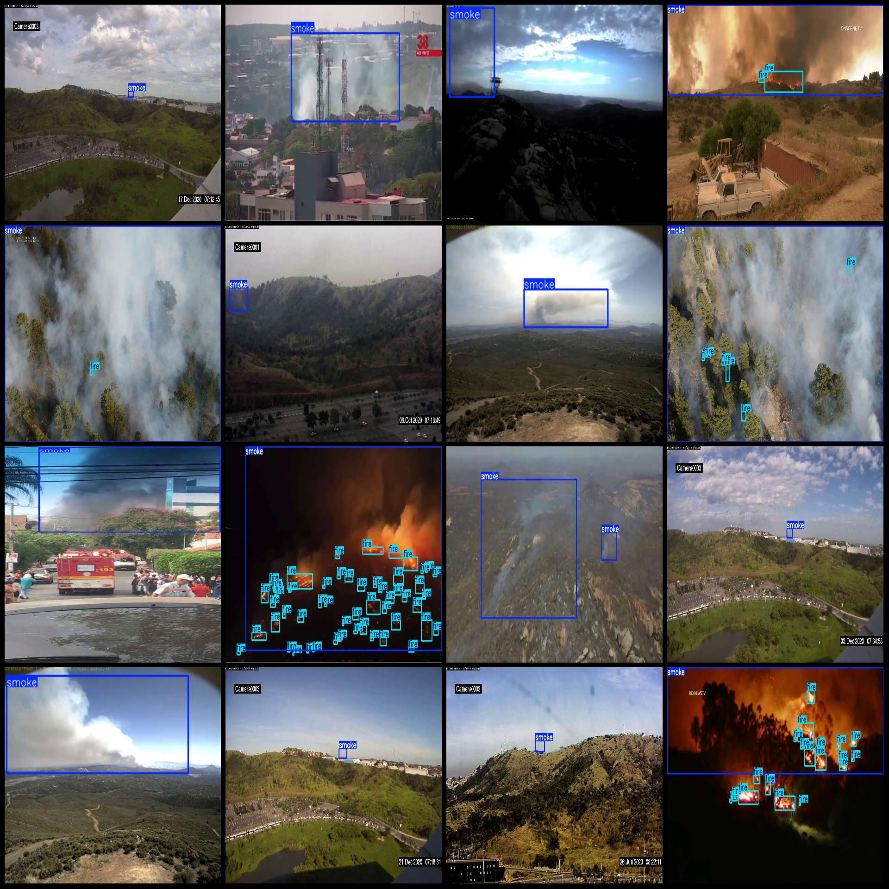
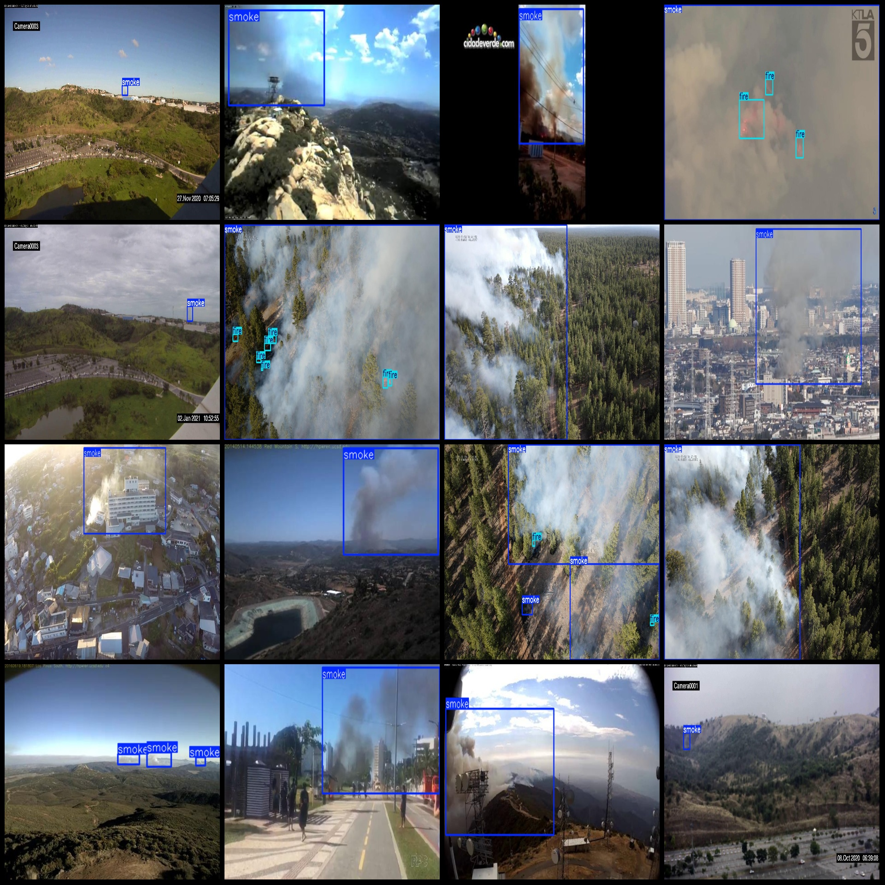

# Monitoring Forest Fire Smoke Detection Dataset VOC+YOLO Format 5927 Images 2 Types

Dataset format: Pascal VOC format + YOLO format (txt files without split paths, only containing jpg images and corresponding VOC format xml files and yolo format txt files)
Number of images (jpg file count): 5927
Number of annotations (xml file count): 5927
Number of annotations (txt file count): 5927
Number of annotation categories: 2
Annotation category names: ["fire", "smoke"]
Each category annotation box count:
fire box count = 14369
smoke box count = 6896
Total box count: 21265
Image resolution: Multi-resolution, such as 1280x720, 820x394, etc.
Use labelImg for annotation tools
Annotation rules: Draw rectangular boxes for categories
Important note: There is no specific statement at the moment
Special declaration: This dataset does not guarantee the accuracy of the trained models or weight files
### Images
## Annotation Example
### Images

Here is a pay link on Stripe ( https://buy.stripe.com/3cs8yP7sY87d0vu9AB ). Please contact me lonlonago@foxmail.com after funding $89, and I will send you a complete data files , thank you!

